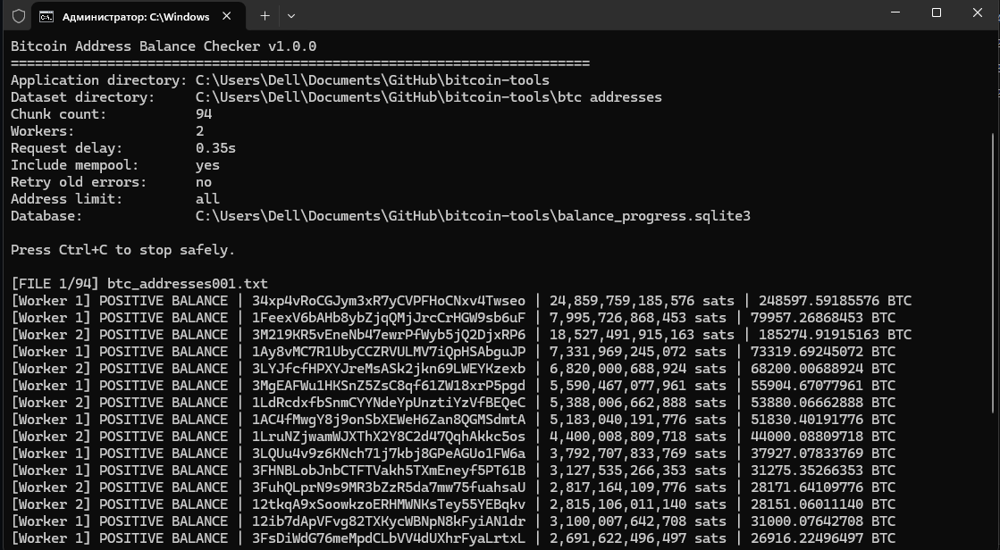

# Bitcoin Address Dataset

A collection of Bitcoin addresses split into multiple **24 MB chunks** for easier cloning, storage, processing, and blockchain analysis.

## Dataset Information

| Property | Value |
|---|---|
| Network | Bitcoin Mainnet |
| Format | Plain Text (`.txt`) |
| Encoding | UTF-8 |
| Records | One address per line |
| Maximum Chunk Size | 24 MiB |
| Total Addresses | **56,701,876** |
| Chunk Naming | `btc_addresses001.txt`, `btc_addresses002.txt`, `btc_addresses003.txt`, ... |
| Included Tool | `btc-balance-checker.exe` |

---

## Repository Structure

```text
bitcoin-tools/
│
├── README.md
├── btc-balance-checker.exe
├── merge_chunks.py
│
├── assets/
│   └── btc-balance-checker-cmd.png
│
└── btc addresses/
    ├── btc_addresses001.txt
    ├── btc_addresses002.txt
    ├── btc_addresses003.txt
    └── ...
```

---

# Why Is the Dataset Split?

Git and GitHub work more reliably with smaller files than with a single multi-gigabyte file.

Instead of storing the dataset as one very large file, this repository stores it as multiple chunks with a maximum size of 24 MiB.

Advantages:

- Easier repository cloning
- More reliable uploads and downloads
- Better Git compatibility
- Lower risk of interrupted transfers
- Low memory usage while processing
- Simple reconstruction into a single file
- Individual chunks can be processed separately

---

# Clone the Repository

Make sure Git is installed, then run:

```bash
git clone YOUR_REPOSITORY_URL
```

Move into the cloned repository:

```bash
cd bitcoin-tools
```

Example:

```bash
git clone https://github.com/rijol95-web3/bitcoin-tools.git
cd bitcoin-tools
```

> Replace the example URL with the actual URL of this repository if the repository name is different.

---

# Rebuild the Complete Dataset

All chunk files can be merged into a single text file.

The merge process:

- reads chunks in numerical order;
- preserves every original byte;
- does not modify or delete any chunk;
- uses streaming and requires very little memory;
- creates a new `btc_addresses.txt` file.

Save the following script as:

```text
merge_chunks.py
```

```python
from pathlib import Path
import re


INPUT_DIRECTORY = Path("btc addresses")
OUTPUT_FILE = Path("btc_addresses.txt")

BUFFER_SIZE = 1024 * 1024

CHUNK_PATTERN = re.compile(
    r"^btc_addresses(\d+)\.txt$",
    re.IGNORECASE,
)


def chunk_number(path: Path) -> int:
    match = CHUNK_PATTERN.fullmatch(path.name)

    if match is None:
        return -1

    return int(match.group(1))


def main() -> None:
    if not INPUT_DIRECTORY.exists():
        raise FileNotFoundError(
            f"Directory not found: {INPUT_DIRECTORY.resolve()}"
        )

    files = [
        path
        for path in INPUT_DIRECTORY.iterdir()
        if path.is_file()
        and CHUNK_PATTERN.fullmatch(path.name)
    ]

    files.sort(key=chunk_number)

    if not files:
        raise FileNotFoundError(
            f"No chunk files found in: {INPUT_DIRECTORY.resolve()}"
        )

    total_bytes = 0

    print(f"Chunks found: {len(files)}")
    print(f"Output file: {OUTPUT_FILE.resolve()}")
    print()

    with OUTPUT_FILE.open(
        "wb",
        buffering=BUFFER_SIZE,
    ) as output:
        for index, path in enumerate(files, start=1):
            print(
                f"[{index}/{len(files)}] Merging {path.name}"
            )

            with path.open(
                "rb",
                buffering=BUFFER_SIZE,
            ) as source:
                while True:
                    data = source.read(BUFFER_SIZE)

                    if not data:
                        break

                    output.write(data)
                    total_bytes += len(data)

    print()
    print("Merge completed successfully.")
    print(f"Output: {OUTPUT_FILE.resolve()}")
    print(
        f"Total size: "
        f"{total_bytes / 1024 / 1024:.2f} MiB"
    )


if __name__ == "__main__":
    main()
```

## Run the Merge Script

Open CMD, PowerShell, or another terminal in the repository directory.

Run:

```bash
python merge_chunks.py
```

On Windows, this may also work:

```bash
py merge_chunks.py
```

After completion, the following file will be created:

```text
btc_addresses.txt
```

The chunk files inside `btc addresses` remain unchanged.

---

# Bitcoin Balance Checker

The repository includes:

```text
btc-balance-checker.exe
```

This is a Windows command-line application that reads Bitcoin addresses from the local chunk files and checks their balances using public Bitcoin APIs.

The executable does not download or replace the dataset. It reads the existing files from:

```text
btc addresses/
```

## Requirements

- Windows 10 or Windows 11
- Internet connection
- The complete `btc addresses` directory
- The executable must remain in the repository root
- No Python installation is required for the `.exe` version

The expected structure is:

```text
bitcoin-tools/
│
├── btc-balance-checker.exe
│
└── btc addresses/
    ├── btc_addresses001.txt
    ├── btc_addresses002.txt
    └── ...
```

---

## Run the Balance Checker

Open CMD inside the repository directory.

An easy way on Windows:

1. Open the repository folder in File Explorer.
2. Click the address bar.
3. Type `cmd`.
4. Press Enter.

Then run:

```bat
btc-balance-checker.exe
```

The program will:

1. Locate all `btc_addressesNNN.txt` chunk files.
2. Read addresses one line at a time.
3. Validate supported Bitcoin address formats.
4. Request balance data from configured public APIs.
5. Save progress in a local SQLite database.
6. Skip previously checked addresses after restart.
7. Export all results to text files.
8. Save addresses with positive balances separately.

---

## CMD Example



The terminal output may look similar to:

```text
========================================================================
Bitcoin Address Balance Checker v1.0.0
========================================================================
Application directory: C:\bitcoin-tools
Dataset directory:     C:\bitcoin-tools\btc addresses
Chunk count:           94
Workers:               2
Request delay:         0.35s
Include mempool:       yes
Database:              C:\bitcoin-tools\balance_progress.sqlite3

Press Ctrl+C to stop safely.

[FILE 1/94] btc_addresses001.txt
[PROGRESS] read=100 | checked=96 | positive=4 | errors=0
[Worker 1] POSITIVE BALANCE | 1ExampleAddress... | 150000 sats
```

---

# Balance Checker Commands

## Check All Addresses

```bat
btc-balance-checker.exe
```

This starts or continues the complete scan.

---

## Test With Only 100 Addresses

Run a small test before starting the full dataset:

```bat
btc-balance-checker.exe --limit 100
```

A larger test:

```bat
btc-balance-checker.exe --limit 1000
```

---

## Choose the Number of Workers

Default:

```text
2 workers
```

Example with one worker:

```bat
btc-balance-checker.exe --workers 1
```

Example with four workers:

```bat
btc-balance-checker.exe --workers 4
```

> Using more workers does not guarantee higher speed. Public APIs may return HTTP `429 Too Many Requests` when too many requests are sent.

---

## Configure the Request Delay

Default delay:

```text
0.35 seconds
```

Example:

```bat
btc-balance-checker.exe --delay 0.50
```

For fewer API rate-limit responses:

```bat
btc-balance-checker.exe --workers 1 --delay 1.0
```

---

## Check Confirmed Balance Only

By default, confirmed and mempool balance changes are included.

To ignore unconfirmed mempool changes:

```bat
btc-balance-checker.exe --confirmed-only
```

---

## Retry Previous Errors

Addresses that previously failed are stored in the progress database.

To retry them:

```bat
btc-balance-checker.exe --retry-errors
```

---

## Export Existing Results Only

To regenerate the TXT reports without sending API requests:

```bat
btc-balance-checker.exe --export-only
```

---

## Display the Version

```bat
btc-balance-checker.exe --version
```

---

## Display Available Options

```bat
btc-balance-checker.exe --help
```

---

# Generated Files

The balance checker creates the following files next to the executable.

## `balance_progress.sqlite3`

Stores:

- checked addresses;
- confirmed balances;
- mempool balance changes;
- transaction counts;
- API provider information;
- previous errors;
- scan progress.

Do not delete this file if you want the program to continue where it stopped.

SQLite may also temporarily create:

```text
balance_progress.sqlite3-shm
balance_progress.sqlite3-wal
```

These are normal SQLite working files.

---

## `balance_results.txt`

Contains all successfully checked addresses.

Example:

```text
address	confirmed_sats	mempool_sats	total_sats	total_btc	confirmed_tx_count	mempool_tx_count
1Example...	150000	0	150000	0.00150000	3	0
bc1qExample...	0	0	0	0.00000000	0	0
```

---

## `positive_balances.txt`

Contains only addresses whose calculated total balance is greater than zero.

Example:

```text
address	confirmed_sats	mempool_sats	total_sats	total_btc
1Example...	150000	0	150000	0.00150000
```

---

## `balance_errors.txt`

Contains addresses that could not be checked successfully.

Possible causes include:

- API rate limits;
- connection timeouts;
- temporary server failures;
- invalid API responses;
- unavailable network connection.

Example:

```text
address	error	attempt_count	last_attempt
bc1qExample...	RuntimeError: All API attempts failed	2	1786050000
```

---

# Stop and Resume

The program can be safely stopped with:

```text
Ctrl+C
```

Successfully completed results remain in:

```text
balance_progress.sqlite3
```

To continue later, run the executable again:

```bat
btc-balance-checker.exe
```

Previously checked addresses will be skipped automatically.

---

# Start a Completely New Scan

To remove all previous progress and begin from zero, close the program and delete:

```text
balance_progress.sqlite3
balance_progress.sqlite3-shm
balance_progress.sqlite3-wal
balance_results.txt
positive_balances.txt
balance_errors.txt
```

Then run:

```bat
btc-balance-checker.exe
```

> This action permanently removes the local scan history.

---

# Important Performance Notice

This dataset contains:

```text
56,701,876 Bitcoin addresses
```

Checking tens of millions of addresses through free public APIs may require a very long time.

The actual speed depends on:

- API rate limits;
- internet latency;
- API availability;
- worker count;
- configured request delay;
- the number of previously checked addresses.

The executable does not bypass API restrictions. HTTP `429` responses mean the API is temporarily rate-limiting requests.

For large-scale or production analysis, running a local Bitcoin node and a local indexing service is substantially more appropriate than relying on public APIs.

---

# Dataset Format

Each line contains one Bitcoin address and no additional metadata.

Example:

```text
1A1zP1eP5QGefi2DMPTfTL5SLmv7DivfNa
3J98t1WpEZ73CNmQviecrnyiWrnqRhWNLy
bc1qexampleaddress...
bc1pexampleaddress...
```

The dataset may contain common Bitcoin address types such as:

- Legacy P2PKH addresses beginning with `1`
- P2SH addresses beginning with `3`
- SegWit addresses beginning with `bc1q`
- Taproot addresses beginning with `bc1p`

---

# Data Integrity Notes

- Addresses are stored exactly as collected.
- Each line contains one address.
- Chunk files should not be manually reordered.
- Chunk numbers determine merge order.
- The merge process is lossless.
- The balance checker does not modify chunk files.
- Scan results are stored separately from the dataset.

---

# Security and Privacy

The application checks public blockchain information only.

It does not:

- generate private keys;
- request seed phrases;
- request wallet passwords;
- access local wallet files;
- sign transactions;
- send Bitcoin;
- modify blockchain data.

Never enter a private key, seed phrase, or wallet password into third-party software or public websites.

---

# Disclaimer

Bitcoin balances can change after they are checked.

The output represents information returned by public APIs at the time of each request. Results may be affected by:

- pending transactions;
- blockchain reorganizations;
- API synchronization delays;
- temporary API failures;
- rate limits.

This project is provided for research, education, data processing, and blockchain analysis purposes.

Users are responsible for complying with applicable laws, API terms, and repository licensing requirements.

---

# License

This repository is provided for research, educational, and blockchain analysis purposes.

Review the repository license before redistributing the dataset, executable, or generated results.
