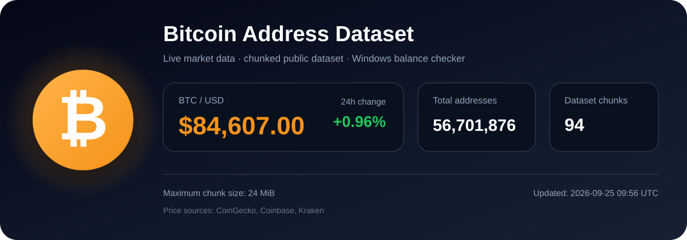

# Bitcoin Address Dataset

<p align="center">
  
</p>

<h1 align="center">Bitcoin Address Dataset</h1>

<p align="center">
A curated collection of <b>56,701,876 Bitcoin addresses</b> distributed across <b>94 optimized chunks</b> for blockchain analysis, research, indexing, and large-scale processing.
</p>

<p align="center">


</p>

---

# Features

- 56,701,876 Bitcoin addresses
- Bitcoin Mainnet
- UTF-8 plain text
- One address per line
- 94 optimized chunk files
- Maximum chunk size: 24 MiB
- Windows balance checker
- Merge utility
- Resume interrupted balance scans
- SQLite progress database
- Automatic live Bitcoin market banner

---

# Dataset Information

| Property | Value |
|----------|------:|
| Network | Bitcoin Mainnet |
| Total Addresses | **56,701,876** |
| Chunks | **94** |
| Maximum Chunk Size | **24 MiB** |
| Format | TXT |
| Encoding | UTF-8 |
| One Address Per Line | ✅ |

---

# Repository Structure

```text
bitcoin-tools/
│
├── assets/
│   ├── bitcoin-stats.svg
│   ├── coinbase.svg
│   └── coingecko.svg
│
├── btc addresses/
│   ├── btc_addresses001.txt
│   ├── btc_addresses002.txt
│   ├── ...
│
├── merge_chunks.py
├── btc-balance-checker.exe
└── README.md
```

---

# Clone Repository

```bash
git clone https://github.com/rijol95-web3/bitcoin-tools.git
cd bitcoin-tools
```

---

# Merge Dataset

Merge every chunk into a single text file.

```bash
python merge_chunks.py
```

Output:

```text
btc_addresses.txt
```

---

# Windows Balance Checker

Run:

```bat
btc-balance-checker.exe
```

Features:

- Reads every dataset chunk
- Validates Bitcoin addresses
- Uses multiple public providers
- Saves progress automatically
- Can resume interrupted scans
- Exports balance results
- Stores positive balances separately

Example:

```bat
btc-balance-checker.exe
btc-balance-checker.exe --limit 100
btc-balance-checker.exe --workers 4
btc-balance-checker.exe --delay 0.5
btc-balance-checker.exe --confirmed-only
btc-balance-checker.exe --retry-errors
btc-balance-checker.exe --export-only
btc-balance-checker.exe --help
```

Generated files:

```text
balance_progress.sqlite3
balance_results.txt
positive_balances.txt
balance_errors.txt
```

---

# Price Sources

<table>
  <tr>
    <td align="center" width="50%">
      <a href="https://www.coingecko.com">
        
      </a>
      <br><br>
      <a href="https://www.coingecko.com">
        <strong>CoinGecko</strong>
      </a>
      <br>
      <sub>BTC/USD price and 24-hour market change</sub>
    </td>

    <td align="center" width="50%">
      <a href="https://www.coinbase.com">
        
      </a>
      <br><br>
      <a href="https://www.coinbase.com">
        <strong>Coinbase</strong>
      </a>
      <br>
      <sub>Independent BTC/USD spot-price reference</sub>
    </td>
  </tr>
</table>

<p align="center">
  The live Bitcoin price displayed in the repository banner is aggregated
  from multiple public market-data providers for better availability,
  fallback support, and price validation.
</p>

---

# Repository Statistics

| Property | Value |
|-----------|------:|
| Bitcoin Addresses | **56,701,876** |
| Dataset Chunks | **94** |
| Maximum Chunk Size | **24 MiB** |
| Balance Checker | Windows EXE |
| Merge Utility | Python |
| Banner | Live SVG |

---

# Performance

The dataset contains more than **56 million** Bitcoin addresses.

Processing the entire dataset using public APIs may require significant time due to provider rate limits and network latency.

For production-scale analysis, a locally synchronized Bitcoin node is recommended.

---

# Security

The provided tools:

- Never request private keys
- Never request seed phrases
- Never modify wallets
- Never sign transactions
- Read only public blockchain information

---

# Disclaimer

Bitcoin balances and blockchain data change over time.

Results depend on the selected public provider and the current blockchain state.

This repository is intended for research, education, blockchain analysis, and software development.

---

# License

See the LICENSE file for licensing information.

---

<p align="center">
Made for the Bitcoin open-source community.
</p>
